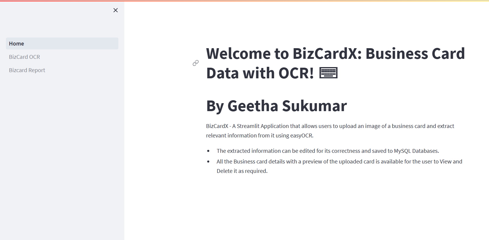
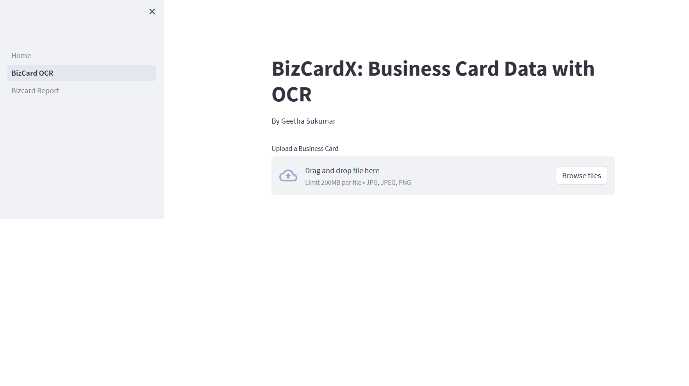
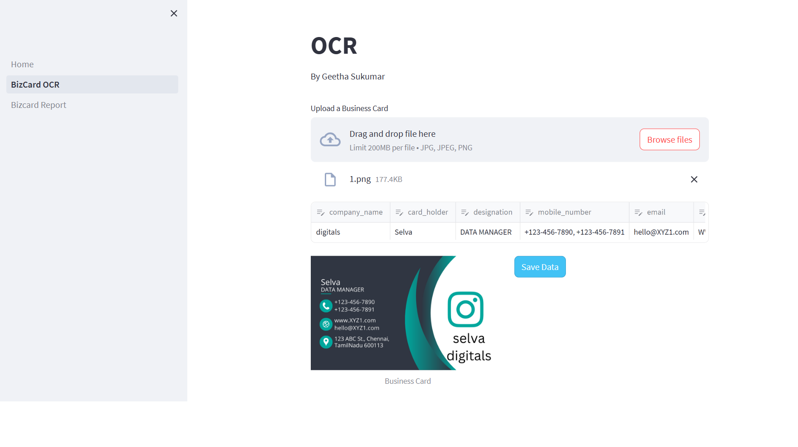
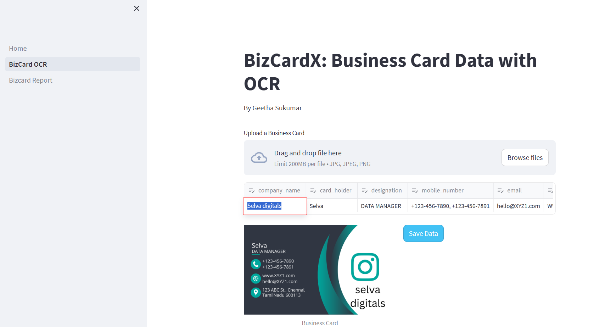
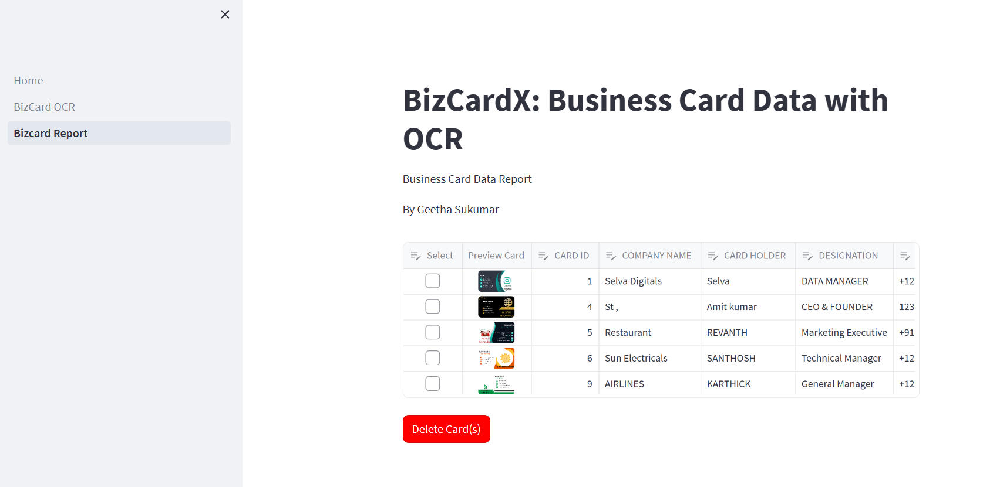
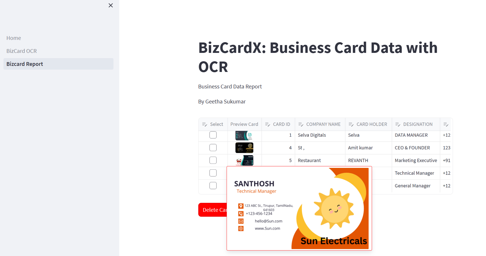

# BizCardReader
BizCardX: Extracting Business Card Data with OCR using easyOCR,streamlit GUI, SQL,Data Extraction

## Objective
BizCardX - A Streamlit Application that allows users to upload an image of a business card and extract relevant information from it using easyOCR.

The extracted information can be edited for its correctness and saved to MySQL Databases.
All the Business card details with a preview of the uploaded card is available for the user to View and Delete it as required.

## Prerequisties
1. MySQL DB.
2. Install the below python packages
  mysql.connector
  streamlit
  easyOcr
  Image
  
## Setup
1. Pull the Home.py, pages,data folder 
2. Create the MySQL DB and 1 table bizcard_data.
3. change the mysql root username and password in the python scripts.
   

## Run the Application
1. Go to Command Prompt
2. Change the working directory to the Directory where the code is pulled to
3. Start the mySQL DB
4. Run the command. The Bizcard application will open up with  3 menus in the sidebar to navigate to different python script in the pages folder.
    streamlit run Home.py

## Results

Click the BizCard OCR and upload an business card for OCR

Edit the data and click Save Data, to save the data to DB.

Available Business Cards in the DB. Delete the ones not necessary

## Contact
Geetha Sukumar
geethsruthi@gmail.com

